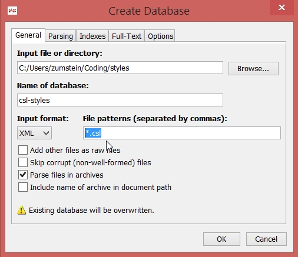
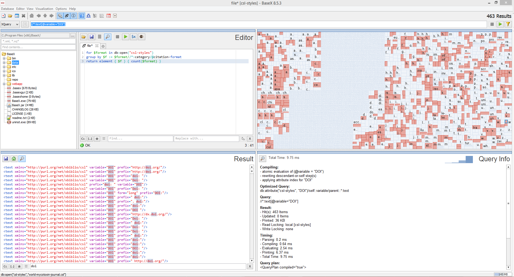
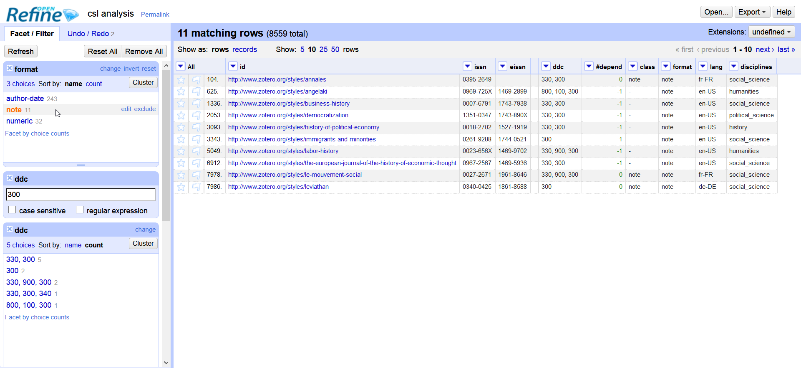

# CSL Analysis

In the subfolders are some scripts and tools for an analysis
the styles of the Citation Style Language (CSL). These scripts
are in some standard formats, e.g. XQuery, and can be reuse
hopefully easily in various ways. However, we describe here
our technology stack to work with this scripts as one example:

## CSL Styles

Start with cloning the current csl styles:
```
git clone https://github.com/citation-style-language/styles.git
```
This gives you the most recent version of the styles. If you want
to work with an older snapshot you can simply `git checkout` it.

## baseX

1. Download and install [baseX](http://basex.org/) for performing the
XQueries.
2. Open baseX
3. Create a new database (Database>New...)
   a. Select the csl styles directory
   b. Choose a reasonable name, e.g. `csl-styles`
   c. Change the file patterns to `*.csl`
   d. Click `Ok`

4. Open the XQuery files `.xq` from the subfolder `xquery` you are
interested in (Editor>Open...)



## Open Refine

We use [Open Refine](http://openrefine.org/) for enrichting
our data with the help of the
[SRU interface of the ZDB](http://www.zeitschriftendatenbank.de/services/schnittstellen/sru/),
which stores informations about journals. Especially we are
interested in the
[main DDC groups](http://www.dnb.de/SharedDocs/Downloads/DE/DNB/service/ddcSachgruppenDNB.pdf?__blob=publicationFile)
for a information about the discipline of the journal.

1. Download and install [Open Refine](http://openrefine.org/).
2. Open the result of the `csl-basic-statistics.xq` TODO w/o Excel
3. Create a new column which calls the URLs and download the
result as XML data. !!For the whole data this took at least 1 hour!!
   a. Create new column based on some column
   b. Use this GREL
   ```
   "http://services.dnb.de/sru/zdb?version=1.1&operation=searchRetrieve&recordSchema=MARC21-xml&query=dnb.iss%3D"  + cells.issn.value + "+OR+" + cells.eissn.value
   ```
   c. Change the waiting time between several requests
   d. Start
   e. Wait...
4. Create a new column for extracting the DDC info
   a. Create a new column based on the previous column with the xml data
   b. Use this GREL
   ```
   uniques(forEach(value.parseHtml().select('datafield[tag=082]>subfield[code=a]'), v, htmlText(v))).join(", ")
   ```
   c. Click `OK`
5. Create a text facet from the row `ddc`
6. Cluster it to merge the same combinations with different order
7. Explore further..



Our current output from this is saved as a CSV file at [open-refine/csl-analysis.csv](open-refine/csl-analysis.csv).

## Gephi

1. Download and install [Gephi](https://gephi.org/).
2. Open Gephi, create a `New Project`
3. Go to the `Data Labratory`, click on `Import spreadsheet`, choose `open-refine/csl-analysis.csv` as the `Nodes table`, in the `Import Settings` choose `Integer` as type for `#depend`
4. Delete the nodes corresponding to dependent styles, i.e. where `#depend` is `-1`.
5. Open `csl-template.csv` with your text editor and add `Source,Target` as your first line.
6. Click again on `Import spreadsheet`, select the adapted [`csl-template.csv`](gephy/csl-template-with-header.csv) as the `Edge table`.
7. Switch to the `Overview` tab
8. Click on `Statistics` and run the detection of the `Connected Components`, afterwards you can in the `Filter` tab filter on the size of the connected componentent (`Partition Count` and choose `Partition ID`). In this way you can filter out single nodes or small components of just a handful nodes to see the big picture.
9. `Appearance>Nodes>Color>Partition` choose for example `ddc-first`
10. `Appearance>Nodes>Size>Ranking` choose for example `#depend`
11. TODO labels
12. For export make sure that you have activated the labels also in the `Preview` tab

See [gephi/graph.png](gephi/graph.png) for the current output.